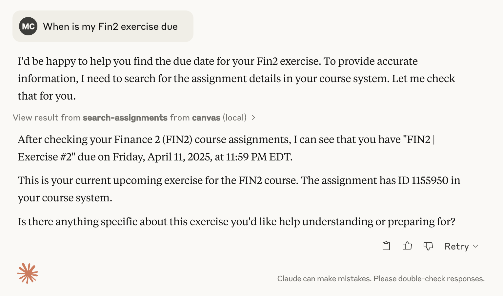

# Canvas Assignment Assistant MCP Server

## Overview

This Model Context Protocol (MCP) server runs as a **Cloudflare Worker** using Server-Sent Events (SSE). 

It lets you interact with Canvas/Instructure courses and assignments, without leaving your LLM (e.g. Claude Desktop).

It allows you to retrieve, search, and summarize course and assignment information programmatically, for example to check due dates for upcoming assignments:




---

## Available Tools

### 1. List Courses
- **Endpoint:** `/list_courses`
- **Description:** Retrieve a list of your Canvas courses, filtered by state.
- **Request Body Example:**
  ```json
  { "state": "active" } // or "completed" or "all" }
  ```
- **Response Example:**
  ```json
  {
    "content": [
      {
        "type": "text",
        "text": "Your active courses:\n\n- ID: 123 | Biology 101 (Fall 2024)\n- ID: 456 | Chemistry 201 (Spring 2024)"
      }
    ]
  }
  ```

### 2. Search Assignments
- **Endpoint:** `/search_assignments`
- **Description:** Search for assignments across your courses by title, description, due date, etc.
- **Request Body Example:**
  ```json
  {
    "query": "essay",
    "dueBefore": "2024-07-01",
    "dueAfter": "2024-06-01",
    "includeCompleted": false,
    "courseId": 12345 // optional
  }
  ```
- **Response Example:**
  ```json
  {
    "content": [
      {
        "type": "text",
        "text": "Found 2 assignments matching \"essay\":\n\n- Course: Biology 101 (ID: 123)\n  Assignment: Final Essay (ID: 789)\n  Due: 6/15/2024, 11:59 PM\n\n- Course: Chemistry 201 (ID: 456)\n  Assignment: Lab Essay (ID: 1011)\n  Due: 6/20/2024, 11:59 PM"
      }
    ]
  }
  ```

### 3. Get Assignment Details
- **Endpoint:** `/get_assignment`
- **Description:** Get detailed information about a specific assignment.
- **Request Body Example:**
  ```json
  {
    "courseId": 12345,
    "assignmentId": 67890,
    "formatType": "markdown" // or "full" or "plain"
  }
  ```
- **Response Example:**
  ```json
  {
    "content": [
      {
        "type": "text",
        "text": "# Final Essay\n\n**Course ID:** 12345\n**Assignment ID:** 67890\n**Due Date:** 6/15/2024, 11:59 PM\n**Points Possible:** 100\n**Submission Type:** online_upload\n\n## Description\n\nWrite a 2000-word essay on genetics."
      }
    ]
  }
  ```

### 4. Assignment Content Resource
- **Endpoint:** `/assignment_content`
- **Description:** Retrieve full assignment content in a standardized format.
- **Request Body Example:**
  ```json
  {
    "courseId": 12345,
    "assignmentId": 67890
  }
  ```
- **Response Example:**
  ```json
  {
    "contents": [
      {
        "uri": "",
        "text": "# Final Essay\n\n**Due Date:** 6/15/2024, 11:59 PM\n**Points Possible:** 100\n**Submission Type:** online_upload\n\n## Description\n\nWrite a 2000-word essay on genetics.",
        "mimeType": "text/markdown"
      }
    ]
  }
  ```

---

## How to Use This MCP Server 

You can use this Canvas MCP server with tools like Claude Desktop or Cursor that support MCP integrations. Here's how to get started:

### 1. Get Your Canvas API Token

1. Log in to your Canvas account in your web browser.
2. Click on your profile/account icon (usually in the top left or top right).
3. Go to **Settings**.
4. Scroll down to the **Approved Integrations** section.
5. Click **New Access Token**.
6. Give it a name (e.g., "MCP Integration") and click **Generate Token**.
7. Copy the token that appears. **Keep this token safe!**

For more details, see [Canvas's official instructions](https://community.canvaslms.com/t5/Canvas-Basics-Guide/How-do-I-manage-API-access-tokens-in-my-user-account/ta-p/615312).

### 2. Add Your Token and Canvas Domain to Your MCP Integration

You can provide your Canvas API token and domain in two ways:

#### **A. As Query Parameters in the URL (Easy for Integrations)**

Just add your Canvas domain and token to the URL, for example:

```
https://canvas-mcp-server.mbcrosier.workers.dev/sse?canvas_domain=YOUR_SCHOOL_DOMAIN&token=YOUR_CANVAS_TOKEN
```

- This works well for integrations (like Zapier or some LLM tools) that only support URL-based configuration.
- **Security Note:** Anyone with this URL can access your Canvas data. Keep it private and do not share it.

#### **B. Using the Authorization Header (More Secure, Preferred)**

- Pass your token in the `Authorization` header as `Bearer <token>`.
- Pass your Canvas domain as a query parameter (`?canvas_domain=...`) or as an `X-Canvas-Domain` header.

---

## Example Usage

- **Endpoint:**
  ```
  https://canvas-mcp-server.mbcrosier.workers.dev/sse?canvas_domain=YOUR_SCHOOL_DOMAIN&token=YOUR_CANVAS_TOKEN
  ```
- **Method:** `POST`
- **Body:**
  ```json
  {
    "tool": "list_courses",
    "params": { "state": "active" }
  }
  ```
- **Other tool examples:**
  - `"tool": "search_assignments"` with params as in the manifest
  - `"tool": "get_assignment"` with params as in the manifest
  - `"tool": "assignment_content"` with params as in the manifest

- **Example cURL:**
  ```sh
  curl -N -X POST \
    'https://canvas-mcp-server.mbcrosier.workers.dev/sse?canvas_domain=YOUR_SCHOOL_DOMAIN&token=YOUR_CANVAS_TOKEN' \
    -H 'Content-Type: application/json' \
    -d '{ "tool": "list_courses", "params": { "state": "active" } }'
  ```

---

## Tool Discovery

- To see all available tools/resources and their parameters, GET or POST to:
  ```
  https://canvas-mcp-server.mbcrosier.workers.dev/manifest
  ```

---

## Notes
- Your Canvas API token is like a password—**never share it** and keep it private.
- If you ever need to remove access, you can delete the token from your Canvas settings.
- If you have trouble connecting, double-check your token and domain for typos.

